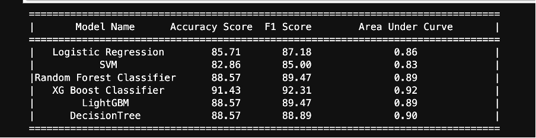

# Parkinson’s Disease Detection

## Objectives:
- Select the best Machine Learning Model for the data
- Save the model for future use

## Pre-Processing
- Load Dataset and analyze the features
- **Total No of features:** 452
- **No NaN values** found in the dataset.
- No feature addition or extraction as dataset explanation is **NULL**.
- **Drop `ID`** as it is not useful.
- Extracting `X` and `y` where:
  - `X` = All labels except `class` (Independent Variables)
  - `y` = `class` (Dependent Variable)
- **Label Encoding** for `class` is required as it is a string.  
  - Two possible values: **H, P**
  - `H` represents **Healthy**, and `P` represents **Patient**.
- This is a **Binary Classification Problem** (0 or 1).

## Models to be Compared:
- **Logistic Regression**
- **SVM**
- **Random Forest Classifier**
- **XGBoost Classifier**
- **LightGBM**
- **Decision Tree**

### Metrics Used for Comparison:
1. **Accuracy Score**
2. **F1 Score**
3. **ROC Curve (AUC Score)**

> **Note:** Scaling is required for **Logistic Regression** and **SVM**.  
> Conditions need to be framed to pass scaled data for these models.

### Conclusion:
- **XGBoost Classifier** has the **highest Accuracy Score** along with the **F1 Score**.
- The **Area Under the Curve (AUC)** computed using the **ROC Curve** function confirms that **XGBoost has the highest probability of detecting the disease effectively**.
- **ROC Curve Image:**  

